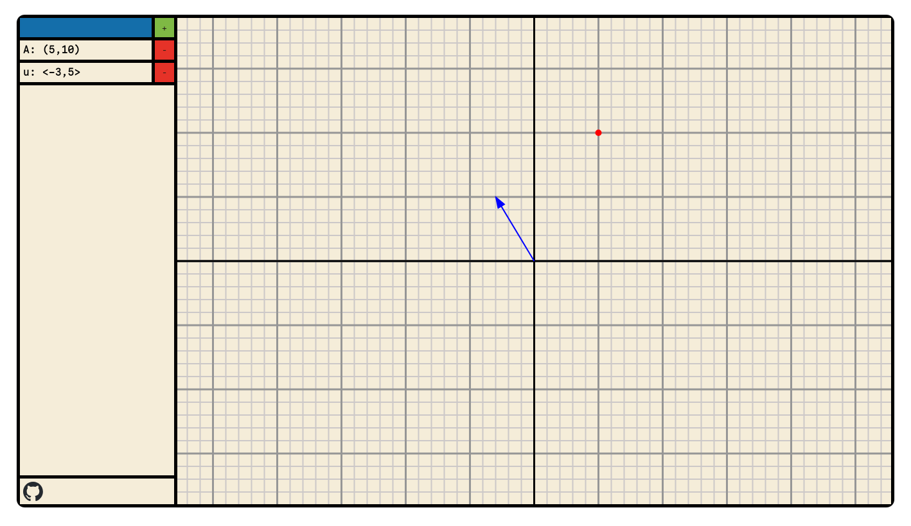

<h1 align="center">
 
  <p>zero</p>
</h1>


[zero](https://tedius-git.github.io/zero/) graphing calculator made with elm
 


## TODO

- [ ] Unique naming
- [ ] Automatic naming
- [ ] aritmetic operations (+,-,*,/)
- [ ] variable declarations

## Development

### Nix

The proyect includes a flake.nix with a devshell with the dependencies. Run:

```bash
# Clone the repo
git clone https://github.com/tedius-git/zero.git

# Enter the devshell
nix develop

# Build and watch for changes
zero-dev

# Dev server 
elm reactor
```

